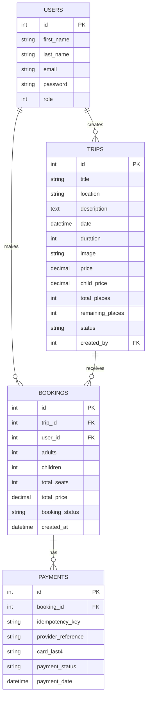

# Entity Relationship Diagram

## Relationship Summary

- One user can create many trips through `trips.created_by`.
- One user can make many bookings through `bookings.user_id`.
- One trip can receive many bookings through `bookings.trip_id`.
- One booking can have payment records through `payments.booking_id`.
