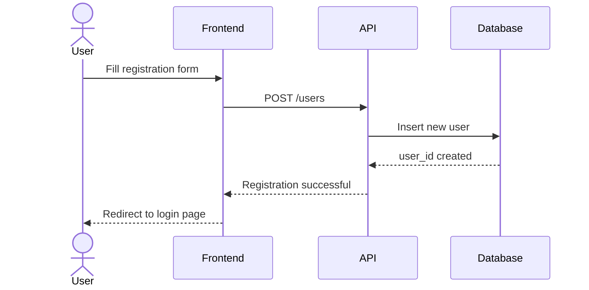
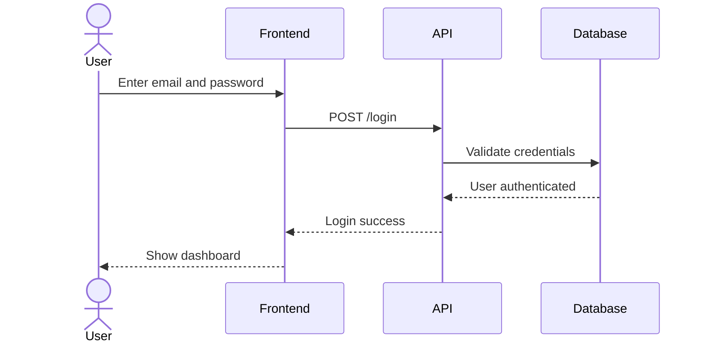
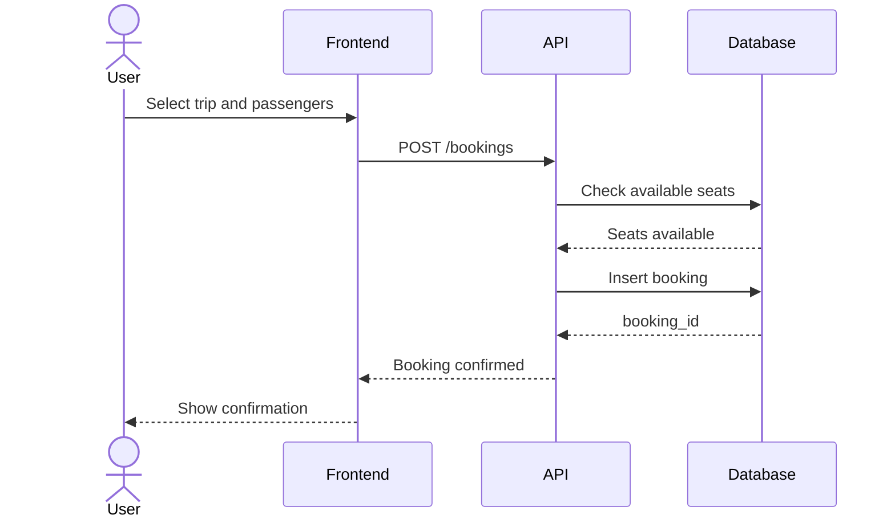

# Sequence Diagrams – Travel Agency

## 1. User Registration

```mermaid
sequenceDiagram
actor User
participant Frontend
participant API
participant DB as Database

User->>Frontend: Fill registration form
Frontend->>API: POST /users
API->>DB: Insert new user
DB-->>API: user_id created
API-->>Frontend: Registration successful
Frontend-->>User: Redirect to login page
```

---

## 2. Login

```mermaid
sequenceDiagram
actor User
participant Frontend
participant API
participant DB as Database

User->>Frontend: Enter email and password
Frontend->>API: POST /login
API->>DB: Validate credentials
DB-->>API: User authenticated
API-->>Frontend: Login success
Frontend-->>User: Show dashboard
```

---

## 3. Book a Trip

```mermaid
sequenceDiagram
actor User
participant Frontend
participant API
participant DB as Database

User->>Frontend: Select trip and passengers
Frontend->>API: POST /bookings
API->>DB: Check available seats
DB-->>API: Seats available
API->>DB: Insert booking
DB-->>API: booking_id
API-->>Frontend: Booking confirmed
Frontend-->>User: Show confirmation
```
 
