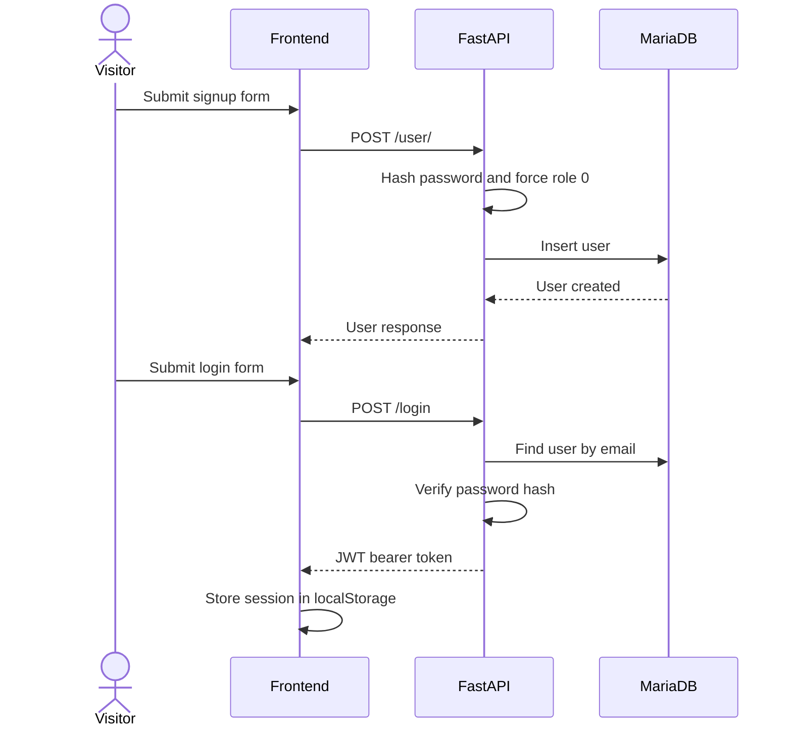
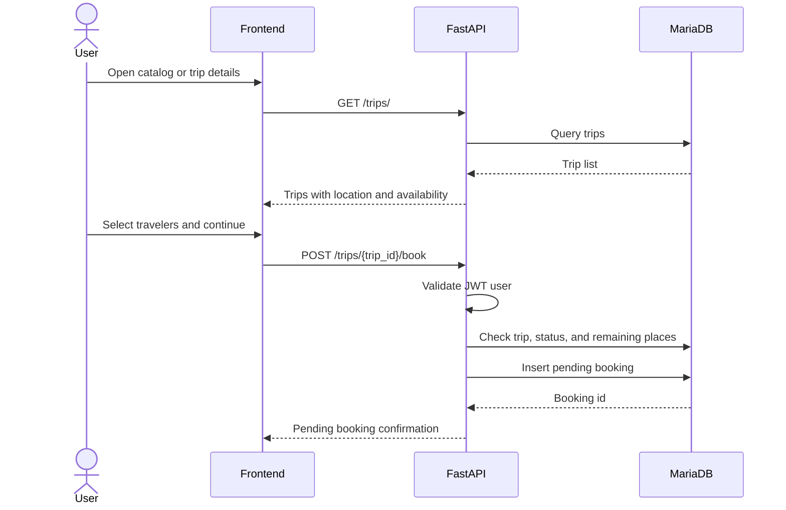
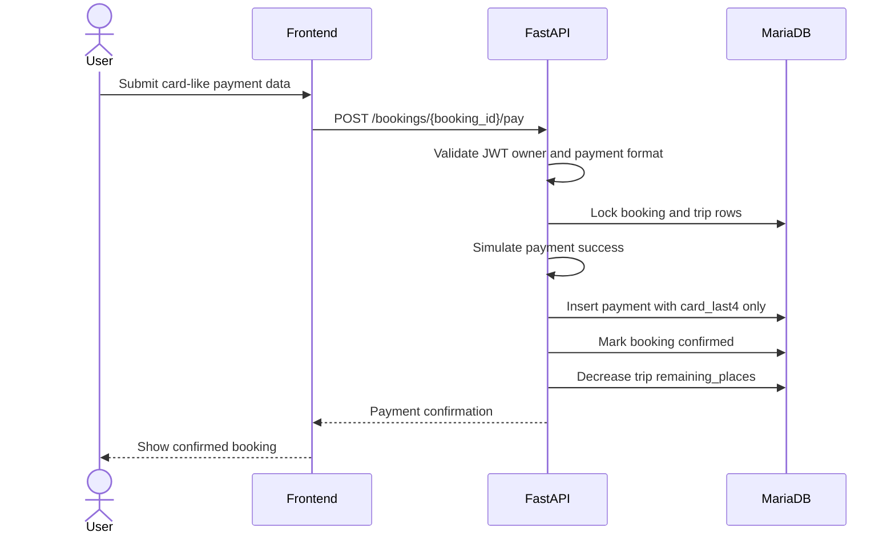
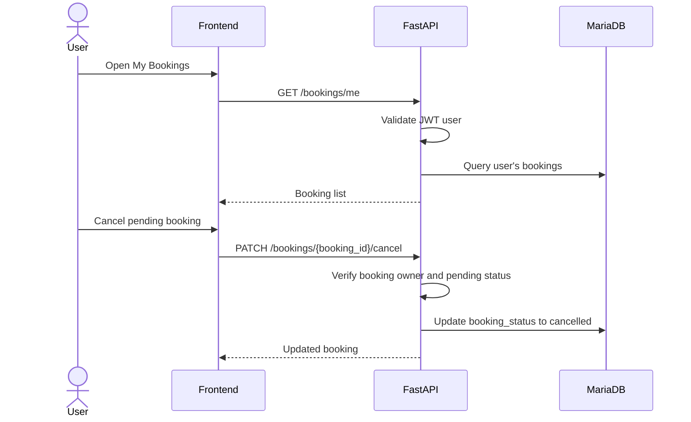
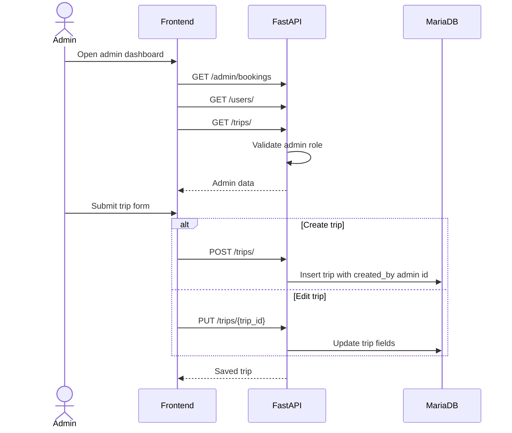

# Sequence Diagrams

## 1. Signup and Login

```mermaid
sequenceDiagram
    actor Visitor
    participant Frontend
    participant API as FastAPI
    participant DB as MariaDB

    Visitor->>Frontend: Submit signup form
    Frontend->>API: POST /user/
    API->>API: Hash password and force role 0
    API->>DB: Insert user
    DB-->>API: User created
    API-->>Frontend: User response

    Visitor->>Frontend: Submit login form
    Frontend->>API: POST /login
    API->>DB: Find user by email
    API->>API: Verify password hash
    API-->>Frontend: JWT bearer token
    Frontend->>Frontend: Store session in localStorage
```

## 2. Browse Trip and Book

```mermaid
sequenceDiagram
    actor User
    participant Frontend
    participant API as FastAPI
    participant DB as MariaDB

    User->>Frontend: Open catalog or trip details
    Frontend->>API: GET /trips/
    API->>DB: Query trips
    DB-->>API: Trip list
    API-->>Frontend: Trips with location and availability

    User->>Frontend: Select travelers and continue
    Frontend->>API: POST /trips/{trip_id}/book
    API->>API: Validate JWT user
    API->>DB: Check trip, status, and remaining places
    API->>DB: Insert pending booking
    DB-->>API: Booking id
    API-->>Frontend: Pending booking confirmation
```

## 3. Simulated Payment

```mermaid
sequenceDiagram
    actor User
    participant Frontend
    participant API as FastAPI
    participant DB as MariaDB

    User->>Frontend: Submit card-like payment data
    Frontend->>API: POST /bookings/{booking_id}/pay
    API->>API: Validate JWT owner and payment format
    API->>DB: Lock booking and trip rows
    API->>API: Simulate payment success
    API->>DB: Insert payment with card_last4 only
    API->>DB: Mark booking confirmed
    API->>DB: Decrease trip remaining_places
    API-->>Frontend: Payment confirmation
    Frontend-->>User: Show confirmed booking
```

## 4. Cancel Pending Booking

```mermaid
sequenceDiagram
    actor User
    participant Frontend
    participant API as FastAPI
    participant DB as MariaDB

    User->>Frontend: Open My Bookings
    Frontend->>API: GET /bookings/me
    API->>API: Validate JWT user
    API->>DB: Query user's bookings
    API-->>Frontend: Booking list

    User->>Frontend: Cancel pending booking
    Frontend->>API: PATCH /bookings/{booking_id}/cancel
    API->>API: Verify booking owner and pending status
    API->>DB: Update booking_status to cancelled
    API-->>Frontend: Updated booking
```

## 5. Admin Creates or Edits Trip

```mermaid
sequenceDiagram
    actor Admin
    participant Frontend
    participant API as FastAPI
    participant DB as MariaDB

    Admin->>Frontend: Open admin dashboard
    Frontend->>API: GET /admin/bookings
    Frontend->>API: GET /users/
    Frontend->>API: GET /trips/
    API->>API: Validate admin role
    API-->>Frontend: Admin data

    Admin->>Frontend: Submit trip form
    alt Create trip
        Frontend->>API: POST /trips/
        API->>DB: Insert trip with created_by admin id
    else Edit trip
        Frontend->>API: PUT /trips/{trip_id}
        API->>DB: Update trip fields
    end
    API-->>Frontend: Saved trip
```
